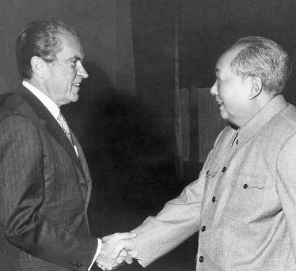

# Uso_economia_come_arma

https://www.youtube.com/watch?v=KUCoio65jNQ

15.50  Sostenere l'ingresso della Cina nell'OMC non attiene ai soli nostri interessi economici ma anche nel più ampio interesse nazionale.
Si Tratta dell'opportunità poiù significativa che abbiamo dagli anni 70 di indurre un cambiamento positivop nel paese.
Questo ingresso promuoverà gli obbiettivi per cui l'America ha lavorato in Cina negli ultimi 30 anni.
Certo l'ingresso della Cina nell'OMC non creerà dall'oggi al domani una società libera in Cina, ma nel tempo muoverà la Cina nella giusta direzione.

Piazza Tien Amen 1989 cosa ci dice: "noi ci prendiamo il capitalismo ma non la democrazia.
La Cina si appropria del capitalismo per alimentare la propria ascesa economica, diplomatica, militare e geopolitica ma non è diventata quel paese che l'America pensava di plasmare attraverso la sua inclusione nei circuiti del capitalismo mondiale.

# Il destino dell'Europa

1.05.00   
C'è una sola azienda al mondo che produce le macchine per la fabbricazione dei chip ed è in Olanda, La asml
Ci sono due aree dove l'Europa è all'avanguardia della tecnologia a livello mondiale: 
* La Asml
la ricerca sulle particelle al Cer di Ginevra, "gli Stati Uniti hanno chiuso i loro acceleratori".  Se consideriamo che il 95% di quello che c'è nell'universo non lo conosciamo e questo viene studiato a Ginevra.

Se andiamo un gradino più sotto, la produzione dei chip, c'è un azienda al mondo leader del settore e si trova a Taiwan la Tsmc.
La gran parte degli ingegneri di questa azienda si sono spostati in occidente. 

Quindi anche se la Cina si prende Taiwan, troverà delle Fabbriche sostanzialmente vuote.

https://www.amazon.it/Potere-progresso-millenaria-tecnologia-prosperit%C3%A0/dp/8842832847/ref=sr_1_1?keywords=9788842832843&qid=1697791487&sr=8-1

## Dedollarizzazione

48.00

Dall scoppio della guerra in Ucraina 2022 i cinesi discutono con gli Emirati arabi della possibilità di accettare la valuta cinese lo Yuan Come metodo di pagamento delle proprie esportazioni petrolifere

Questo perché il Petrodollaro, il la legame tra petrolio e valuta americana è uno
dei modi in cui gli Stati Uniti confermano ed affermano La supremazia
del dollaro su gli scambi globali.

Non pagare un barile di petrolio in dollari significa mettere in discussione l'egemonia economica americana.

Swap agreement, accordi di scambio valutario tra le banche centrali dei
paesi delle monarchie del Golfo e la Banca Centrale cinese; fino a 7 miliardi di dollari di valore si può scambiare facilmente  valute locali mantenute o dall'una o dall'altra Banca Centrale. Yuan cinesi con diram Emiratino.
Questi accordi esistono tra Emirati Arabi Uniti e Cina ed Emirati Arabi Uniti ed India e quello tra l'Arabia Saudita e la Cina
Questi accordi ci dicono che l'Arabia Saudita e gli Emirati Arabi Uniti ritengono
credibile di avere nelle proprie riserve centrali fino a 7 miliardi di dollari di
valore di Yuan cinesi

Si vuole iniziare ad utilizzare di più le monete locali invece del dollaro per fare scambi commerciali per una ragione molto semplice: tutto il sistema finanziario internazionale su cui il dollaro transita è di fatto un'istituzione sotto il controllo del tesoro americano. Non c'è un modo più semplice per il Dipartimento del Tesoro americano di implementare sanzioni contro aziende ed istituzioni fuori dal territorio americano che colpire la loro possibilità di fare transazioni in dollari.

Esempio pratico: una società a Dubai che fa scambi anche di natura strategica con una società cinese come nel settore dell'intelligenza artificiale, e fa questi scambi in dollar, è vulnerabile domani  ad essere sanzionata dal Dipartimento del Tesoro cioè il Dipartimento del Tesoro gli dice Tu è vero stai negli Emirati Arabi Uniti quindi fuori dalla mia giurisdizione territoriale la tua controparte sta in Cina Quindi ovviamente fuori dalla mia giurisdizione territoriale ma poiché utilizzate il dollaro la vostra transazione di fatto dipende da una infrastruttura che io Stati Uniti controllo pur essendo a decine di migliaia di chilometri di distanza e quindi posso impedire o creare delle difficoltà nei pagamenti.

Questa non è fantascienza è una cosa che gli emiratini i cinesi ed i russi hanno già visto accadere innumerevoli volte.

C'è un motivo per cui il dollaro è la moneta egemone a livello globale e cioè che monete locali come lo Yuan o come il diram emiratino hanno ovviamente meno garanzie, sono molto meno Liquide, hanno meno casi d'uso.

Negli Emirati Arabi Uniti però si sta già tentando di risolvere il problema con una serie di progetti pilota tra i più avanzati al mondo, l'utilizzo di criptovalute.
Non solo il dollaro, non solo lo Yuan, non solo il diram, ma anche criptovalute che  girano su infrastrutture finanziarie totalmente decentralizzate fuori dal controllo di qualsiasi stato, americano, cinese, russo, e con una liquidità immediata. 

L'infrastruttura fisica che consente queste nuove tecnologie gioca un ruolo molto importante negli assetti socio economici mondiali.