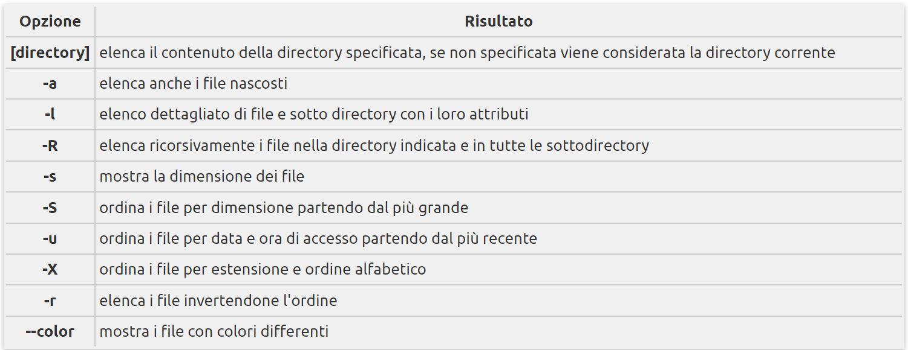

Gestione di file e directory

* pwd
Il comando pwd serve per mostrare la directory in cui ci si trova.

* ls
Il comando ls serve per elencare il contenuto di una directory.

La sintassi del comando è:  ls [opzione] [directory]

* cd

Il comando cd serve per spostarsi all'interno delle directory del filesystem.

La sintassi del comando è:  cd [directory]

Spostarsi alla directory superiore 
cd .. 
Spostarsi da qualsiasi punto nella propria directory home: 
cd 
Spostarsi nella directory /etc: 
cd /etc

* mkdir

Il comando mkdir serve per creare directory all'interno del filesystem.

La sintassi del comando è: mmkdir [opzioni] directory

Creare la directory prova/ all'interno della directory corrente: 
mkdir prova

Creare la directory prova all'interno della propria home directory, qualunque sia la directory in cui ci si trova al momento: 
mkdir ~/prova

* cp

Il comando cp serve per:

copiare un file in un altro file; 
copiare un file in un'altra directory; 
copiare più file in un'altra directory; 
copiare directory. 
La sintassi del comando è la seguente:

cp [opzioni] origine destinazione

Copiare il file miofile della directory prova nella directory /prova1: 
cp /prova/miofile /prova1

Copiare il file miofile della directory /prova nella directory /prova1 dandogli il nome nuovofile: 
cp /prova/miofile /prova1/nuovofile

Copiare la cartella /prova, e tutto il suo contenuto, nella cartella /prova_copia: 
cp -r /prova /prova_copia
* mv

Il comando mv serve per spostare, o rinominare, file e directory.

La sintassi del comando è: mv [opzioni] origine destinazione

Cambiare il nome al file miofile in nuovofile: 
mv miofile nuovofile

Spostare il file miofile nella directory /prova, sovrascrivendo un eventuale file con lo stesso nome: 
mv miofile /prova

Cambiare il nome alla directory /prova in /prova_nuova: 
mv /prova /prova_nuova

Spostare la directory /prova nella directory già esistente /prova.bak: 
mv /prova /prova.bak

* rm e rmdir

Il comando rm serve per cancellare file o directory dal file system.

La sintassi del comando è: rm [opzioni] file ...
Alcune opzioni da utilizzare con il comando rm:

-i, chiede conferma prima di cancellare 
-f, forza la cancellazione del file senza chiedere conferma

Il comando rmdir serve per cancellare directory dal file system.

La sintassi del comando è: rmdir directory

Cancellare il file miofile: 
rm miofile

Cancellare la directory prova/ e tutto il suo contenuto: 
rm -rf prova/

Cancellare la directory prova/ solo se questa non contiene alcun file all'interno: 
rmdir prova/

Bibliografia: 
[Wiki_Ubuntu](https://wiki.ubuntu-it.org/AmministrazioneSistema/ComandiBase) 
[Permessi_File](https://wiki.ubuntu-it.org/AmministrazioneSistema/PermessiFile#chmod)