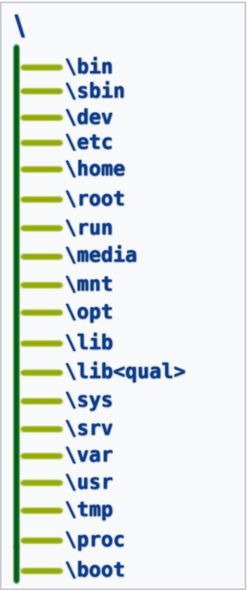

# Il filesystem

il Filesystem Hierarchy Standard (FHS) («Standard di Gerarchia dei Filesystem») è uno standard che definisce le directory principali ed il loro contenuto nel file system dei sistemi operativi Unix-like. E'rappresentato dal simbolo «/» detto root (radice), da non confondere con la cartella /root che rappresenta la Home dell'amministratore.

Il processo di sviluppo di una gerarchia standard per i file system iniziò nell'agosto 1993 

Nei sistemi Unix e suoi derivati è definito uno standard sull'albero delle directory di sistema. Tuttavia ogni distribuzione può apportare proprie personalizzazioni. Di seguito quindi è illustrato un elenco 

/bin 
Contiene i programmi basilari per la gestione del sistema, in pratica buona parte dei comandi base utilizzabili dalla riga di comando da qualsiasi utente senza dover utilizzare i privilegi dell'amministratore.

/boot 
Contiene le immagini del kernel e i file indispensabili al bootstrap del sistema. In particolare il file /boot/grub/grub.cfg è fondamentale per l'impostazione dei parametri di avvio del bootloader Grub.

/dev 
È la directory che individua le periferiche hardware sotto forma di file. 
Per esempio, un hard disk può essere qui individuato dal file /dev/sda e le sue partizioni attraverso i file /dev/sda1, /dev/sda2, ecc. Occorre tuttavia precisare che in questa directory i dispositivi di memorizzazione non sono esplorabili direttamente. Per visionarne il contenuto si possono sfruttare le cartelle che il sistema  crea automaticamente nella directory /media o, in alternativa, effettuare il montaggio manualmente.

/etc 
Contiene i file di configurazione del sistema.
Fra i numerosi file è opportuno ricordare /etc/fstab, fondamentale per definire le partizioni da rendere disponibili all'avvio del sistema.

Di seguito un elenco con il contenuto di alcune delle sotto-directory principali:
* /etc/apt: file di configurazione dei repository, in particolare /etc/apt/sources.list.

* /etc/grub.d: file per personalizzare la sequenza di boot del sistema.

* /etc/samba: contiene /etc/samba/smb.conf, file di configurazione per la condivisione dati tramite Samba.

* /etc/X11: file per la configurazione delle schede video per il server graficoXorg.

/home 
Contiene tutte le directory personali degli utenti del sistema.

Ad esempio se è stato creato un utente con il nome mario, allora all'interno della directory /home sarà presente la cartella /home/mario. Questa sotto-cartella riveste un ruolo importantissimo, in quanto memorizza dati e impostazioni dei programmi utilizzati dallo stesso utente. Questi di solito vengono memorizzati sotto forma di file nascosti (davanti al nome hanno un punto). Ad esempio nella cartella .mozilla saranno presenti i dati riguardanti il browser Firefox (segnalibri, estensioni, cronologia, ecc.). È solitamente possibile visualizzare e accedere ai file nascosti tramite file manager premendo la combinazione di tasti Ctrl + H.

/lib 
Contiene tutte le librerie condivise del sistema.

/lost+found 
Contiene le parti di file recuperate al riavvio in caso di interruzione della corrente elettrica, nel caso in cui vengano persi i dati sui quali si stava lavorando.

/media 
Secondo gli standard dovrebbe essere la directory destinata al montaggio dei dispositivi rimovibili o qualsiasi dispositivo di memorizzazione.

Ogni volta che un dispositivo viene collegato al computer o dal file manager si seleziona una partizione dell'hard disk, il sistema crea all'interno della directory /media una cartella dalla quale è possibile esplorarne il contenuto.

/mnt 
È secondo gli standard la directory destinata al montaggio dei dispositivi. 

/opt 
È deputata a contenere sotto-directory per programmi opzionali o comunque non standard.   Tuttavia può venire occupata dai programmi installati dall'utente, come ad esempio software proprietari e/o di terze parti (non presenti nei repository) che non rispettano la struttura del filesystem standard.

/proc 
Contiene le informazioni relative al sistema, come un file system virtuale creato dal kernel dinamicamente istante per istante, in memoria e non sul disco.

/root 
Contiene la directory home dell'amministratore del sistema ed è esplorabile solo utilizzando i privilegi del super utente. Il contenuto è analogo a quello delle singole home-utente descritte nel capitolo della directory /home.

/run 
È stata introdotta da alcuni anni per sostituire la directory /var/run (quest'ultima è ancora presente come collegamento). Fornisce al sistema una posizione standard per archiviare alcuni dati volatili, che però non possono essere memorizzati in /tmp altrimenti verrebbero eliminati.

/sbin 
Contiene i programmi base per l'amministrazione del sistema. È una directory analoga a /bin con la differenza che in questo caso gli eseguibili necessitano per il loro utilizzo i privilegi dell'amministratore.

/sys 
Similmente alla directory /proc funziona da file system virtuale. Al suo interno vengono visualizzati i dispositivi collegati e i moduli del kernel attivi.

/tmp 
Contiene file temporanei.

/usr 
È la directory che contiene la maggior parte dei programmi installati sul sistema.

Segue un breve elenco con il contenuto di alcune delle sotto-directory principali:

* /usr/bin: file eseguibili delle applicazioni accessibili a tutti gli utenti, vale a dire i programmi normalmente avviabili dal menù delle applicazioni.

* /usr/sbin: file eseguibili delle applicazioni di sistema accessibili solo all'amministratore.

* /usr/share: file di vario genere (configurazione, documenti di testo, ecc.) indipendenti dall'architettura del sistema (i386, amd64, ecc.). Ad esempio le cartelle backgrounds, icons e themes contengono rispettivamente sfondi del desktop, icone e temi; dal file /usr/share/synaptic/html/index.html si accede ad una guida in formato html su Synaptic, ecc.

* /usr/src: codice sorgente, ad esempio del kernel e dei relativi headers.

/var 
Contiene tutti file che hanno informazioni dinamiche, che tendono a modificarsi con il tempo: log, file di pid e lock dei processi in esecuzione, directory di spool (stampa, mail...) ecc.

Di seguito sono citate alcune delle sotto-directory principali:

* /var/log: file di registro sui quali viene salvato ciò che avviene al sistema in ogni istante. Consultare i file di log può aiutare a risalire alle cause di eventuali problemi nel sistema. 

* /var/cache/apt/archives: durante il processo di installazione dei programmi è in questa cartella che viene memorizzata una copia di sicurezza dei pacchetti .deb scaricati. Dal momento che con il tempo possono arrivare ad occupare molto spazio di memoria, l'amministratore può prendere in considerazione la rimozione dei pacchetti, sia manualmente sia attraverso apt.

Bibliografia
[Ubuntu](https://wiki.ubuntu-it.org/AmministrazioneSistema/Filesystem#A.2Fhome)
