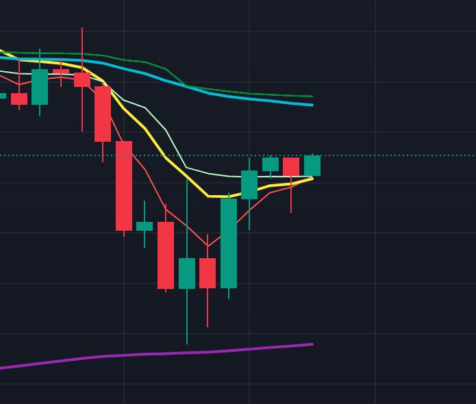
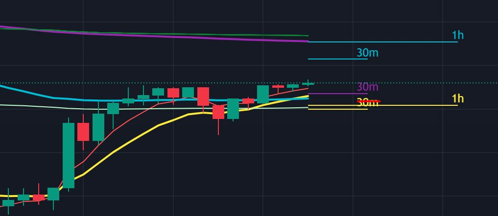

# TF 1h-15m con target 60 a 30m

* Individuo un trend sopra la 10 a 1 h

Vado a vederlo a TF 15 m dove la 60 corrisponde alla 10 a 1 h e calcolo il mio SL

 Passo al 30 m dove posiziono il mio target sulla 60 che è il primo target sopra la 10 a 1 h

 
