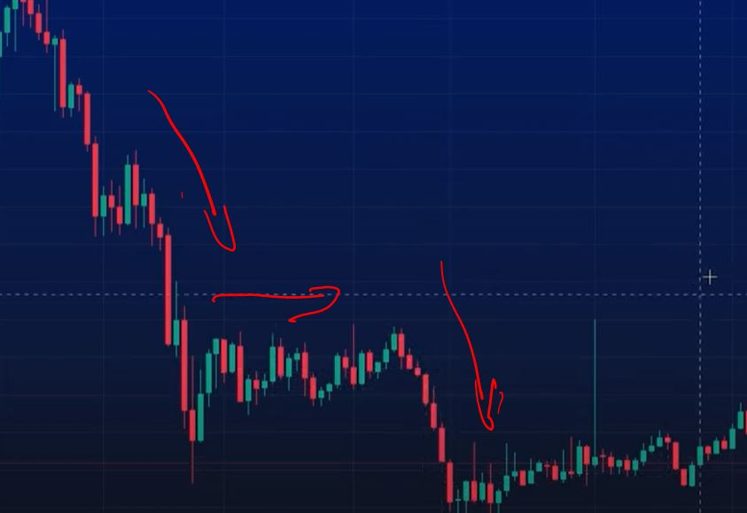
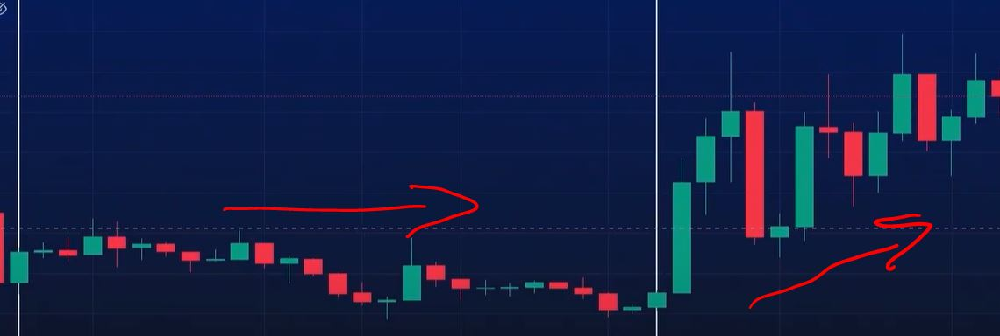
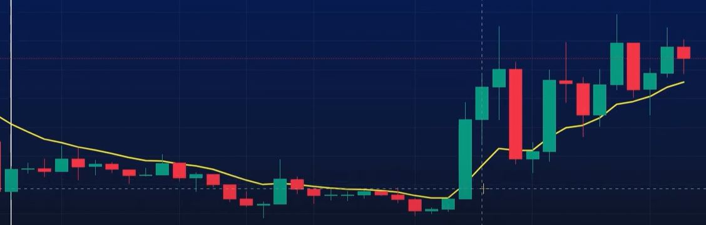
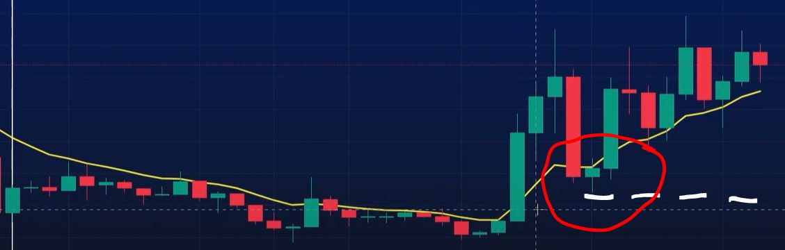
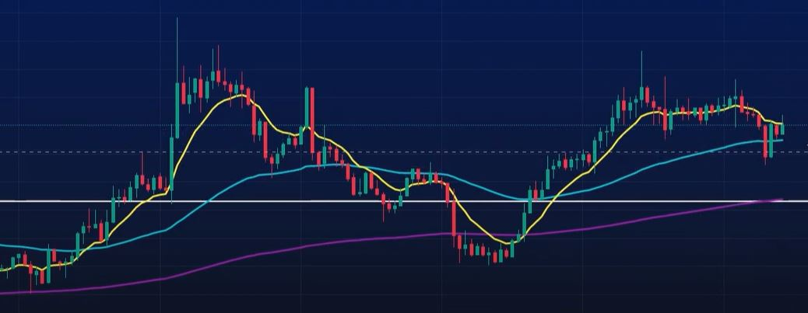

# Il concetto di Trend

* Il trend è un movimento importante e duraturo del prezzo di una coin.   Possiamo riconoscere tre tipi di Trend in un grafico a candele:
1. Trend rialzista dove l' apertura delle candele  tende ad alzarsi  
2. Trend ribassista. dove l' apertura delle candele tende ad abbassarsi 
3. Trend di lateralizzazione dove chiusure ed aperture delle candele rimangono all'interno di un range di prezzo.

## L'Ema 10 per capire il Trend 
Ema = media mobile esponenziale.  Calcola la media del prezzo di chiusura delle ultime 10 candele dando maggior peso alle candele  più recenti rispetto a quelli meno recenti. Da non confodere con la media mobile semplice.

senza Ema 10

Con Ema 10

Quando le candele stanno sopra l' Ema 10 il trend è rialzista e la nostra Ema supporta il prezzo, quando le camdele stanno sotto l' Ema 10, il trend è ribassista e la nostra Ema fa da resistenza al prezzo.

## Perchè l' Ema 10
I grossi investitori con ingenti capitali comprano o vendono sulla Ema 10. Noi dobbiamo fare lo stesso per avere maggiori probabilità di fare operazioni in gain.

## La finta sulla 10

Evidenziato in rosso rottura Ema 10 al ribasso.

Quando la candela rompe l'Ema 10 al ribasso o al rialzo, il Trend potrebbe cambiare. Potrebbe, perchè se la candela ritorna sulla 10 possiamo parlare di finta sulla 10 e su questo ritorno noi possimao fare le nostre operazioni.

* regola nr 1 compra semper vicino alla 10
* regola nr 2 le finte creano punti trigger molto interessanti

## Il timeframe dove la 10 comanda

I grossi investitori comprano o vendono su diversi Timeframe.

* regola nr 3 cercare il Timeframe dove la 10 comanda, perchè è li che gli investirtori stanno comprando o vendendo.

Individuato il Timeframe, il passo successivo è calibrare il nostro ingresso su Timeframe piu piccoli.  Per fare questo dobbiamo introdurre 2 nuove Ema; la 60 e la 225 che approssimano la 10 del nostro Timeframe di riferimento.

Approssimano la 10 perchè se su Timframe piccolo abbiamo movimenti repentini, la 225 si muoverà piu velocemente delle 10 di riferimento.
Sul canale Discord di Andrea possiamo trovare la tabella con le correlazioni delle Ema nei vari Timeframe.

Per il momento lavoreremo sulla Ema 10 a TF Daily e la sua corrispondente Ema 225 su TF 1h

## l'Ema 5
Un breve accenno all' ultima Ema che andremo ad utilizzare nelle nostre opaerzioni, la 5.  Ema 5 indica Fomo. Quando comanda la 5 possiamo cercare la 10 sul Tf che è la metà del TF di riferimento.

## Fonti e approfondimenti

[TradingTwice Trendline pt 1](https://www.youtube.com/watch?v=vrwmmGmG7EM&t=641s)

[Correlazione tra TF](https://discord.com/channels/1130912234864910398/1155524984307982446)