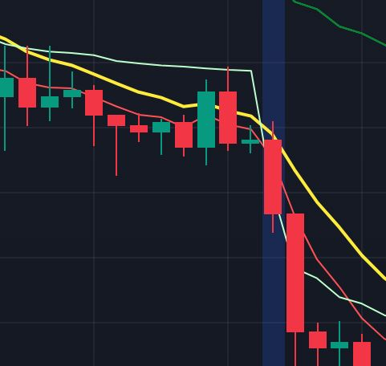

Al centro del disegno la canela verde fa una finta sulla 10 chiudendo sopra. La successiva rossa dopo un timido tentativo di salita chiude sotto la 10.

A rafforzare le probabilità di un trend short la candelina verde sotto la 10.