# Impaginazione 

* entra nella schermata articoli
* premi modifica rapida

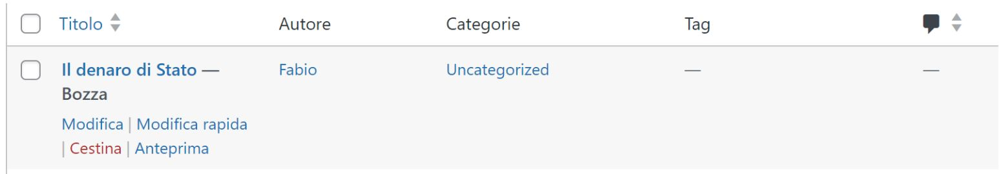

* Scegliere la categoria

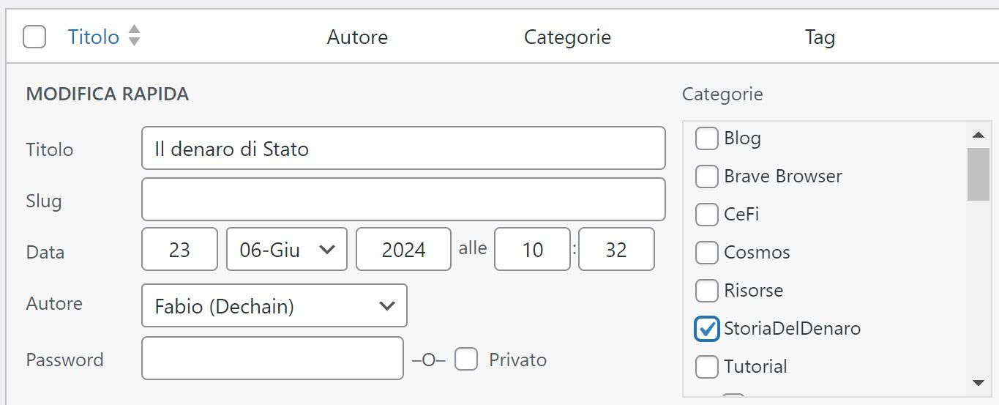

* inserire spazio vuoto tra paragrafi

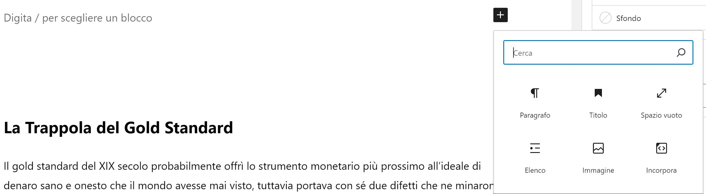

* impostarlo a 30

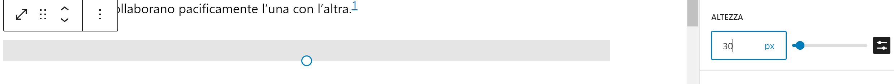

# Colore testo

Il testo che vogliamo in rosso dobbiamo evidenziarlo,

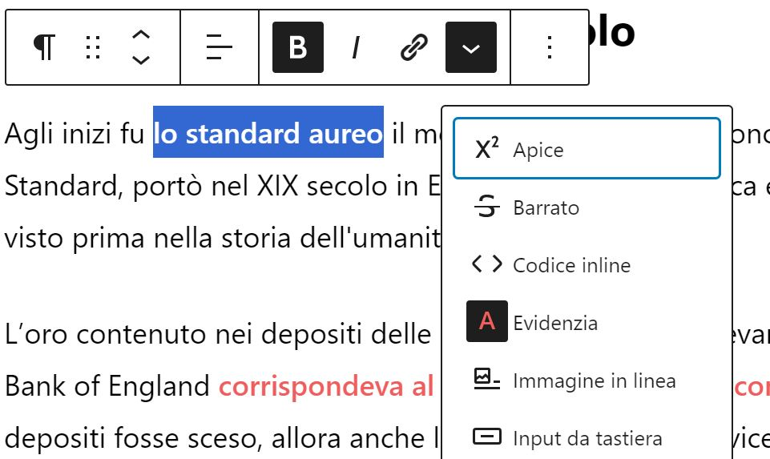

* premi la freccia
* premi Evidenzia

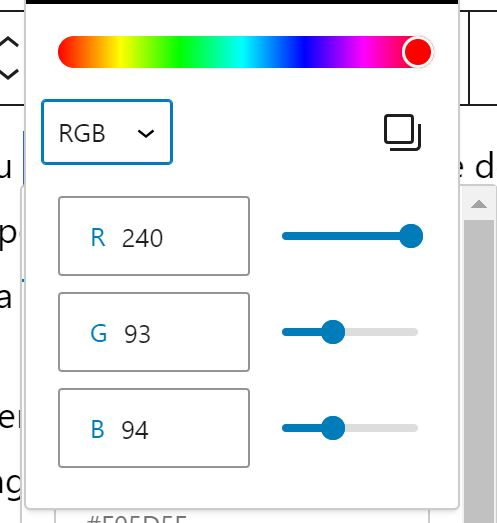

* scegliere Rgb ricopiare i dati come da figura. Corrisponde a Hex  F05D5E

# Immagine

* Allinea immagine

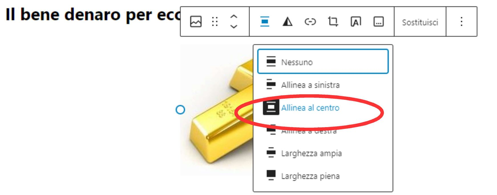

* Titolo immagine

clicca su immagine e sostituisci

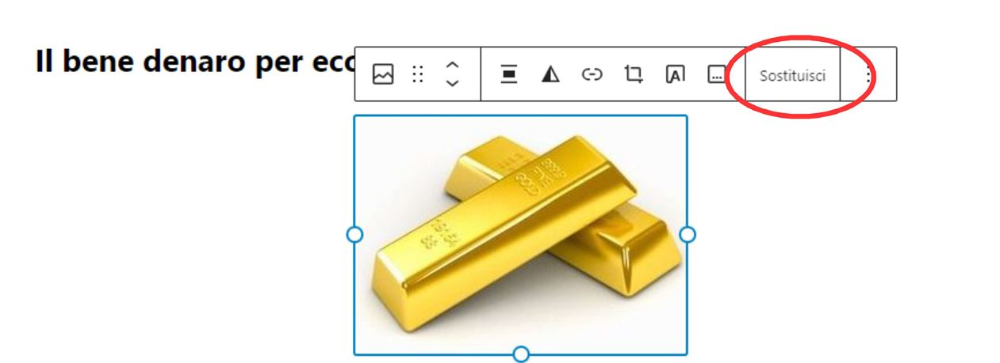

apri libreria media

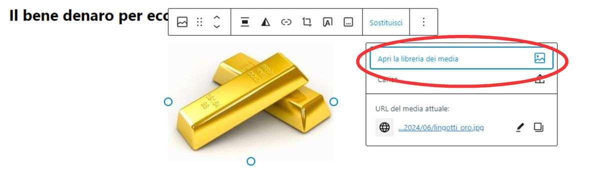

completa i campi che compaiono nella scheda immagine

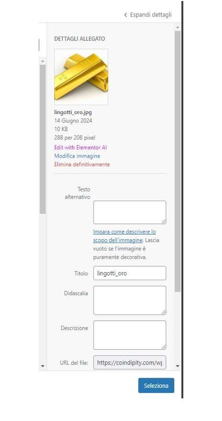

# SEO
* Completa la parte SEO sotto articolo con metadescrizione etc

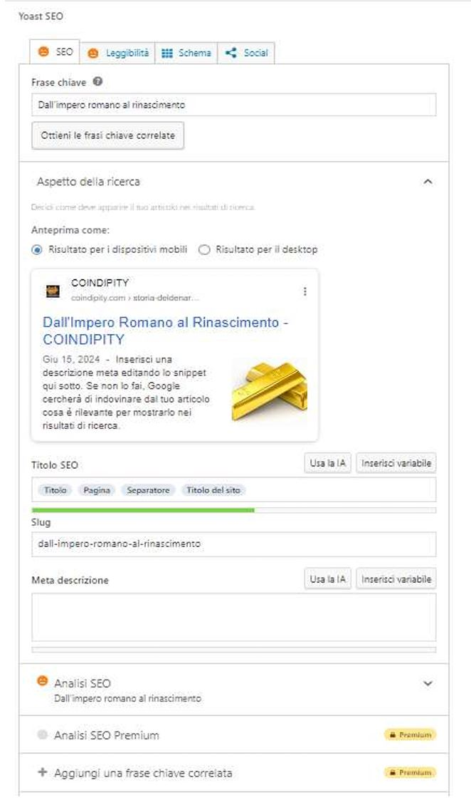